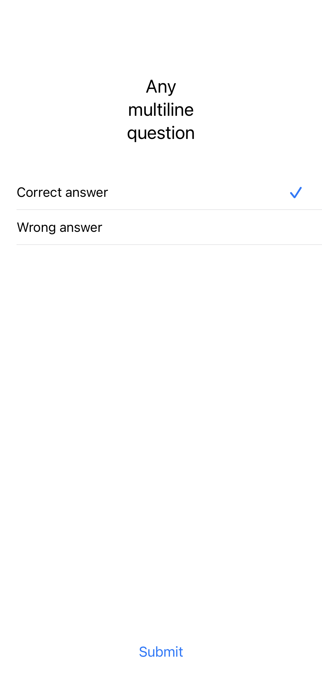
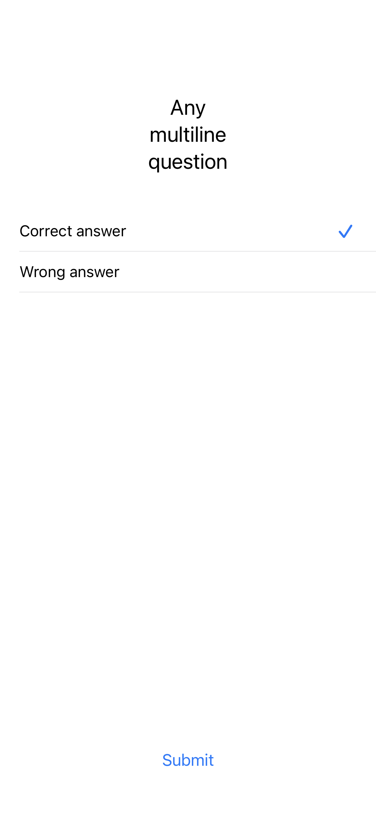

## Trivia App

### Scenario: Player answers trivia questions
```
- Story:
As a player
I want to answer trivia questions
So I can test my knowledge in a fun way

- Acceptance criteria:
Given the player starts a game
When the player answers all questions
Then the app should display the score summary
```

### Scenario: Player wants to see the score
```
- Story:
As a player
I want to see my final score
So I can see my overall performance in the quiz

- Acceptance criteria:
Given the player is in the last question
When the player submits the last answer
Then the app should display the final score
```

### Scenario: Player wants to play again
```
- Story:
As a player
I want to replay the trivia after finishing it
So I can challenge myself against my previous try

- Acceptance criteria:
Given the player finishes a game
When the player taps on "play again"
Then the app should start another round of trivia questions
```


https://user-images.githubusercontent.com/19872825/209148105-f368d3cb-9ac8-464b-81a8-e3b6ef481c1f.mov


### Question Screen:

<p>
  
  
</p>

### Results Screen:

<p>
  
  
</p>
