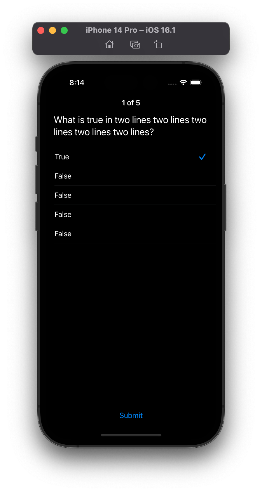
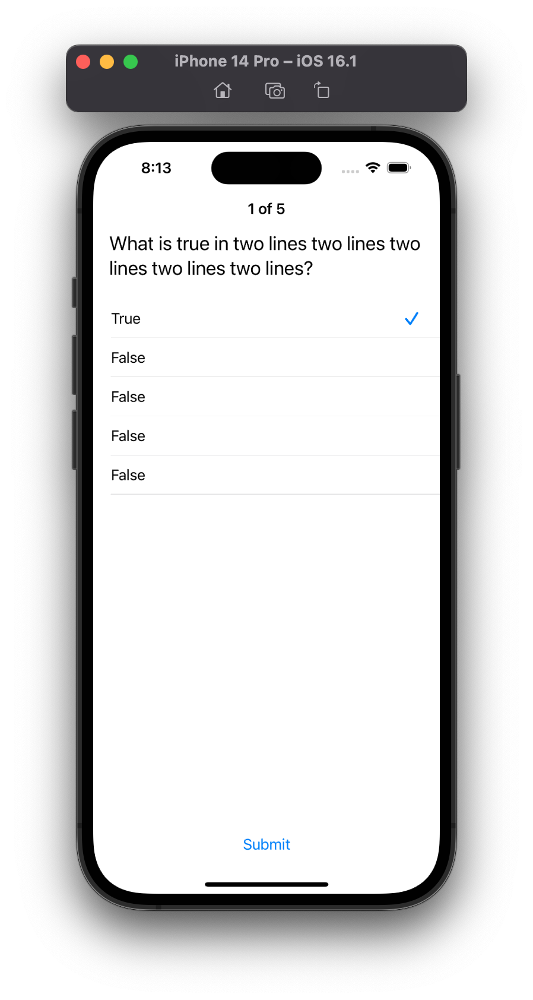

## Trivia App

### Scenario: Player answers trivia questions
```
- Story:
As a player
I want to answer trivia questions
So I can test my knowledge in a fun way

- Acceptance criteria:
Given the player starts a game
When the player answers all questions
Then the app should display the score summary
```

### Scenario: Player wants to play again
```
- Story:
As a player
I want to replay the trivia after finishing it
So I can challenge myself against my previous try

- Acceptance criteria:
Given the player finishes a game
When the player taps on "play again"
Then the app should start another round of trivia questions
```

### Question Screen:

<p float="left" align="middle">
  
  
</p>